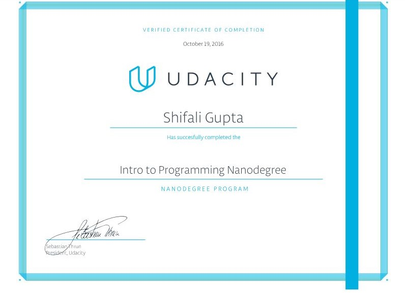

# Udacity-Intro-to-Programming-Nanodegree

The Nanodegree equips you with the foundational knowledge and skills that all programmers use whether they program mobile apps, create web pages, or analyze data.
Successful completion of this program will enhance your skills, broaden your opportunities, and lay the groundwork for a future in technology.

**You will learn** - HTML, CSS, Python Programming Foundations, Object-Oriented Programming with Python and many more.

#### Nanodegree Certificate

